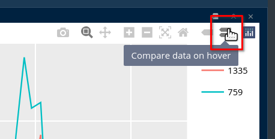

```{r setup, include=FALSE}
knitr::opts_chunk$set(collapse = TRUE, warnings = FALSE)
```

**Stéphane Guillou**

Technology Trainer, The University of Queensland Library


## Prerequisites 

This R workshop assumes basic knowledge of R including:

* Installing and loading packages
* How to read in data with `read.csv()`, `readr::read_csv()` and similar
* Creating objects in R
* How to transform data frames and tibbles with `dplyr`

We are happy to have any and all questions though!

## What are we going to learn?

In this first part of the workshop, we will learn how to:

* Read data from multiple sheets into an object
* Clean the data and extract information
* Explore the data visually

## Create a project

To work cleanly, we need to:

* Create a new project in RStudio
* Create a new script to write our R code
* Create a data directory to store our data in

## Load packages

For this workshop, we will use many tools from the Tidyverse: a collection of packages for data import, transformation, visualisation and export.

```{r packages, warning=FALSE}
library(tidyverse)
```

## About the data

Sampling design: Atmospheric samples of the Compound X were collected each day during seven consecutive days for different month in the year. Some year and months had less samples due to technical problems.

### Download the data

Let's download our dataset form the web:

```{r download data, eval=FALSE}
download.file("https://github.com/seaCatKim/PACE-LIB-R-timeseries/raw/main/content/post/2020-12-01-part1-working-timeseries-data/data/analytes_data.xlsx",
              destfile = "data/analytes_data.xlsx")
```

### Read in the data

We have an XLSX workbook that contains several sheets. The first one is only documenting what the data is about, whereas the two other ones contain the data we are interested in.

The package [readxl](https://readxl.tidyverse.org/) is useful for importing data stored in XLS and XLSX files. For example, to have a look at a single sheet of data, we can do the following:

```{r}
# load the package
library(readxl)
# only import the second sheet
analytes <- read_excel("data/analytes_data.xlsx",
                       sheet = 2)
```

We could also point to the correct sheet by using the sheet name instead of its index. For that, the `excel_sheets()` function is useful to find the names:

```{r}
# excel_sheets() shows the sheet names
excel_sheets("data/analytes_data.xlsx")
analytes <- read_excel("data/analytes_data.xlsx", sheet = "Site_759")
```

Let's have a look at the first few rows of data:

```{r}
head(analytes)
```


### Bind several workbook sheets

Even though this workbook only has two sheets of data, we might want to automate the reading and binding of all data sheets to avoid repeating code. This comes in very handy if you have a workbook with a dozen sheets of data, or if your data is split between several files.

The purrr package allows "mapping" a function (or a more complex command) to several elements. Here, we will _map_ the reading of the sheet to each _element_ in a vector of sheet names.

Using the `map_dfr()` function makes sure we have a single data frame as an output.

```{r}
# only keep sheet names that contain actual data
sheets <- excel_sheets("data/analytes_data.xlsx")[2:3]
# map the reading to each sheet
library(purrr)
analytes <- map_dfr(sheets,
                    ~ read_excel("data/analytes_data.xlsx", sheet = .x))
```

We could map a function by simply providing the name of the function. However, because we are doing something slightly more elaborate here (pointing to one single file, and using an extra argument to point to the sheet itself), we need to use the `~` syntax, and point to the element being processed with the `.x` placeholder.

> For more information on the different options the `map` family offers, see `?map`.

## Data cleaning

There are a few issues with the dataset. First of all, there are variations in how the compound is named. We can replace the value in the first column with a simpler, consistent one:

```{r typos}
# all same compound
analytes$Analyte <- "x"
```

Our column names are not the most reusable names for R. Better names do not contain spaces or special characters like `/`. dplyr's `rename()` function is very handy for that:

```{r rename columns}
library(dplyr)
analytes <- rename(analytes, Site = 1, Date = 3, mg_per_day = 4)
```

Finally, the Site column is stored as numeric data. If we plot it as it is, R will consider it to be a continuous variable, when it really should be discrete. Let's fix that with dplyr's `mutate()` function:

```{r sites as character}
analytes <- mutate(analytes, Site = as.character(Site))
```

> We could convert it to a factor instead, but the Tidyverse packages tend to be happy with categorical data stored as the character type.

### Export a clean dataset

We now have a clean dataset in a single table, which we could make a copy of, especially to share with others, or if we want to split our code into several scripts that can work independently.

```{r write to CSV}
write.csv(analytes, "data/analytes_data_clean.csv",
          row.names = FALSE)
```

> `write.csv()` will by default include a column of row names in the exported file, which are the row numbers if no row names have been assigned. That's not usually something we want, so we can turn it off with `row.names = FALSE`

## Visualisation with ggplot2

At this stage, we can start exploring visually. For a lot of R users, the go-to package for data visualisation is ggplot2, which is part of the Tidyverse.

For a ggplot2 visualisation, rememember that we usually need this three essential elements:

* the dataset
* the mapping of aesthetic elements to variables in the dataset
* the geometry used to represent the data

Let's try a first timeline visualisation with a line plot:

```{r simple viz}
library(ggplot2)
ggplot(analytes,             # data
       aes(x = Date,         # mapping of aesthetics
           y = mg_per_day,
           colour = Site)) + # (separate by site)
  geom_line()                # geometry
```

A simple line plot is not great here, because of the periodicity: there were bursts of sampling, several days in a row, and then nothing for a while. Which results in a fine, daily resolution for small periods of time, and a straight line joining these periods of time.

We might want to "smoothen" that line, hoping to get a better idea of the trend, keeping the original data as points in the background:

```{r}
ggplot(analytes, aes(x = Date, y = mg_per_day, colour = Site)) +
  geom_point() +
  geom_smooth()
```

The trend lines only give a very general trend. What if we make it follow the points more closely?

```{r}
ggplot(analytes, aes(x = Date, y = mg_per_day, colour = Site)) +
  geom_point(size = 0.3) + # smaller points
  geom_smooth(span = 0.05) # follow the data more closely
```

With the method used, we end up with an increased uncertainty (the shaded area around the curves). It also creates artificial "dips" to fit the data, for example close to the beginning of 2000 for the site 1335.

## Summarise the data

In this case, because we have sampling points for what looks like groups of successive days, we can try to summarise them.

Operations on time-date data can be done more comfortably with extra packages. The Tidyverse comes with the lubridate package, which has been around for a while and is very powerful. Another, more recent package called "[clock](https://clock.r-lib.org/)" can do most of what lubridate can, and more, but it is still being heavily developped, so we stick to lubridate here.

Let's start by extracting all the date components that could be useful:

```{r extract date components}
library(lubridate)
analytes <- analytes %>% 
   mutate(year = year(Date),
          month = month(Date),
          day = day(Date),
          week = week(Date),
          weekday = weekdays(Date))
```

How many sampling days per month are there?

```{r samples per month}
analytes %>% 
   group_by(Site, year, month) %>% 
   count() %>% 
   head(12)
```

The number of samples per month is irregular, and some months have no data.

Furthermore, the week numbers don't align with the sampling weeks, and some sampling weeks overlap over two months:

```{r see month overlaps}
analytes %>%  select(year, month, day, week) %>%  head(10)
```

In any case, the fact that week numbers are reset at the beginning of the year wouldn't help.

One way to group the sampling days together is to detect which ones are spaced by one day, and which ones by a lot more:

```{r space}
analytes <- analytes %>%
   arrange(Site, Date) %>% # make sure it is in chronological order
   group_by(Site) %>% # deal with sites separately
   mutate(days_lapsed = as.integer(Date - lag(Date))) %>%  # compare date to next date
   ungroup()
```

> Grouping by site is important, otherwise we get an erroneous value at the row after switching to the second site. Because we grouped, it does not compare to the previous value in the different site, but instead only returns an `NA`.

How consistent are the sampling periods? Let's investigate:

```{r investigate spacing}
analytes %>% 
   count(days_lapsed) %>% 
   head()
```

It looks like some sampling days might have been missed, so we can define a sampling period as "a period in which sampling times are not spaced by more than 3 days".

To create a grouping index, we can first assign a value of `TRUE` to the first row of each time period, and then use the cumulative sum function on that column (as it converts `TRUE`s to 1s and `FALSE`s to 0s):

```{r define periods}
analytes <- analytes %>% 
   group_by(Site) %>%
   mutate(sampling_period = row_number() == 1 | days_lapsed > 3,
          sampling_period = cumsum(sampling_period)) %>%
   ungroup()
```

We can now use these new group indices to summarise by time period:

```{r summarise periods}
analytes_summary <- analytes %>% 
   group_by(Analyte, Site, sampling_period) %>% # we are keeping Analyte
   summarise(Date = round_date(mean(Date), unit = "day"),
             mg_per_day = mean(mg_per_day)) %>% 
   ungroup()
```

Let's try again our line plot with the summarised data:

```{r line plot summarised}
ggplot(analytes_summary,
       aes(x = Date,
           y = mg_per_day,
           colour = Site)) +
  geom_line()  
```

This is a lot cleaner than what we had originally!

## Export summarised data

We have previously exported a CSV, which is a great, simple format that can be opened pretty much anywhere. However, if you want to save an R object to reopen it exactly as it was, you can use an R-specific format like RData.

```{r export RData}
save(analytes_summary, file = "data/summary.RData")
```

The file can then be imported again with the `load()` function. You won't need to convert the columns to the correct data type again.

## Interactive visualisation

Exploring timelines might be more comfortable with an interactive visualisation. [Plotly](https://plotly.com/r/) is a helpful library available for various programming languages, and the plotly package makes it easy to use it in R.

Once a visualisation is created in R, it is trivial to convert it to a Plotly visualisation with one single function: `ggplotly()`.

```{r ggplotly}
# save as an object
p <- ggplot(analytes_summary,
       aes(x = Date,
           y = mg_per_day,
           colour = Site)) +
  geom_line()
# turn it into a plotly visualisation
library(plotly)
ggplotly(p)
```

To focus on a section, draw a rectangle (and double-click to reset to the full view).


With several time series plotted, it is useful to change the hover setting to "compare data on hover" with this button:



It is however possible to set a similar hover mode as a default:

```{r hovermode}
ggplotly(p) %>% 
   layout(hovermode = "x unified")
```

## Rolling operations

With time series affected by seasonality, or with a lot of variation creating visual noise, it is sometimes useful to represent long-term trends with a rolling average.

The package [RcppRoll](https://cran.r-project.org/package=RcppRoll) is useful for this kind of windowed operation:

```{r rolling average}
library(RcppRoll)
analytes_summary %>% 
   group_by(Site) %>% 
   mutate(rolling_mean = roll_mean(mg_per_day,
                                   n = 6,          # the size of the window
                                   fill = NA)) %>% # to have same length
   ggplot(aes(x = Date,
           y = rolling_mean,
           colour = Site)) +
  geom_line()
```

This method might not be the best for this data, but it proves very useful in other cases, for example for COVID-19 daily infection rates (with a 7-day window).

## Next: part 2

In [Part 2](2022/01/27/timeseries-data/), you will learn about analysing time series data.

````{comment}

(This section is commented out as the feature seems broken currently.)

Another helpful functionality is the ability to add a slider to restrict the time range:

```{r}
ggplotly(p) %>% 
   rangeslider()
```

````
