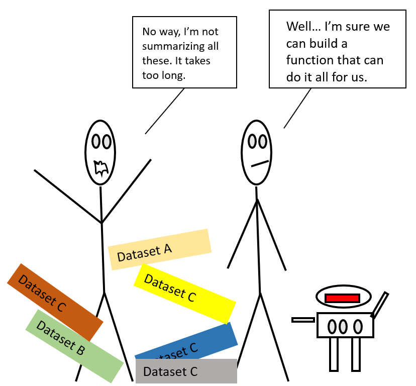

```{r setup, include=FALSE}
knitr::opts_chunk$set(echo = FALSE)
```

## Introduction {.columns-2}

If we only had one data set to analyze, it would probably be faster to load the file into a spreadsheet and use that to plot some simple statistics. But suppose we have 20, 100 files to check, and may have more in the future.

In this talk, we will learn how to write a function in R so that we can repeat several operations with a single command.

<p class="forceBreak">

</p>

{width="100%"}

## How do we make a function in R?

The anatomy of a function is:

```{r, echo=TRUE, eval=FALSE}
my_function <- function(argument){
  # fancy_code goes here
  # using the ***argument**
  # to do something cool
  # **returns** a results 
}
```

Let's define a function `fahr_to_kelvin()` that converts temperatures from Fahrenheit to Kelvin:

```{r, echo=TRUE}
fahr_to_kelvin <- function(temp_F) {
  temp_K <- (temp_F - 32) * 5 / 9 + 273.15
  return(temp_K)
}
```

## Running our function {.smaller}

Calling our own function is no different from calling any other function:

```{r, echo=TRUE}
fahr_to_kelvin(32) # freezing point of water
```

```{r, echo=TRUE}
fahr_to_kelvin(212) # boiling point of water
```

What about converting from Kelvin to Celsius?

```{r, echo=TRUE}
kelvin_to_celsius <- function(temp_K) {
  temp_C <- temp_K - 273.15
  return(temp_C)
}
```

## Compose functions {.columns-2 .smaller}

What about converting Fahrenheit to Celsius?

We could write out the formula... but we don't need to.

Instead, we can compose the two functions we have already created:

```{r, echo=TRUE}
fahr_to_celsius <- function(temp_F) {
  temp_K <- fahr_to_kelvin(temp_F)
  temp_C <- kelvin_to_celsius(temp_K)
  return(temp_C)
}
```

Which is warmer 23 Celsius or 73 Fahrenheit?

```{r, echo=TRUE, eval=FALSE, message=FALSE}
fahr_to_celsius(73)
```

<p class="forceBreak">

</p>

{width="100%"}

## But what about unintended inputs?

We should note that it is important to ensure that functions only work in their intended use-cases. Checking function parameters encourages us to frequently check conditions and throw an error if something is wrong.

```{r, echo=TRUE, error=TRUE}
fahr_to_kelvin("cat")
```

## Let's try and make it a little bit friendlier

R provides the convenience function `stopifnot()`, which basically says "if this is not `TRUE` stop and return this message".

```{r, echo=TRUE}
fahr_to_kelvin2 <- function(temp_F) {
  stopifnot("Input must be numeric" = is.numeric(temp_F))
  temp_K <- (temp_F - 32) * 5 / 9 + 273.15
  return(temp_K)
}
```

Now if we pass `"cat"` to our function:

```{r, echo=TRUE, message=TRUE, error=TRUE}
fahr_to_kelvin2("cat")
```


# Exercises


## Remember

It's important to both **testing** and **documenting** functions:

-   Documentation helps you, and others, understand what the purpose of your function is, and how to use it and;

-   its important to make sure that your function actually does what you think.

Note: Formal automated test can be written using the `testthat` packages.

## Benefits of writing functions

From [Ch 19 Functions](https://r4ds.had.co.nz/functions.html) in R for Data Science (Grolemund & Wickham):

**1.** You can give a function an evocative name that makes your code easier to understand.

**2.** As requirements change, you only need to update code in one place, instead of many.

**3.** You eliminate the chance of making essential mistakes when you copy and paste (i.e., updating a variable in once place, but not in another).

## Further reading

-   [R for Data Science](https://r4ds.had.co.nz/functions.html) by Hadley Wickham & Garrett Grolemund (Chapter on Functions)

-   [Software Carpentry -- Creating function](https://swcarpentry.github.io/python-novice-inflammation/08-func/index.html)

-   [Introduction to functions](https://docs.google.com/presentation/d/e/2PACX-1vQI2_jMfAiH4hAVXO8AYE5g8w6iC_N3LIZhZwYYQI5vRRRCwD6_517EkzUU0zwCM2a-BcZvx3YOLyno/pub?start=false&loop=false&delayms=3000&slide=id.p) by Allison Horst
