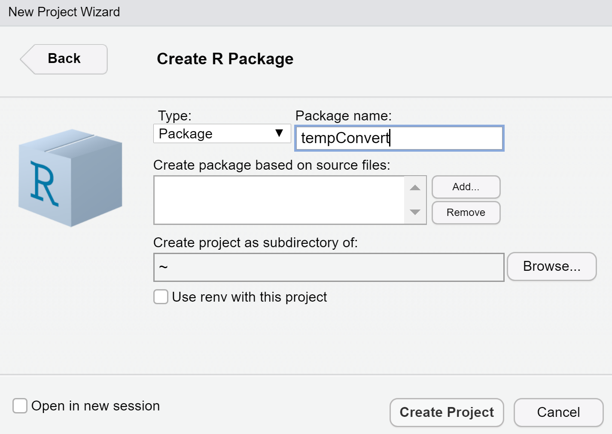
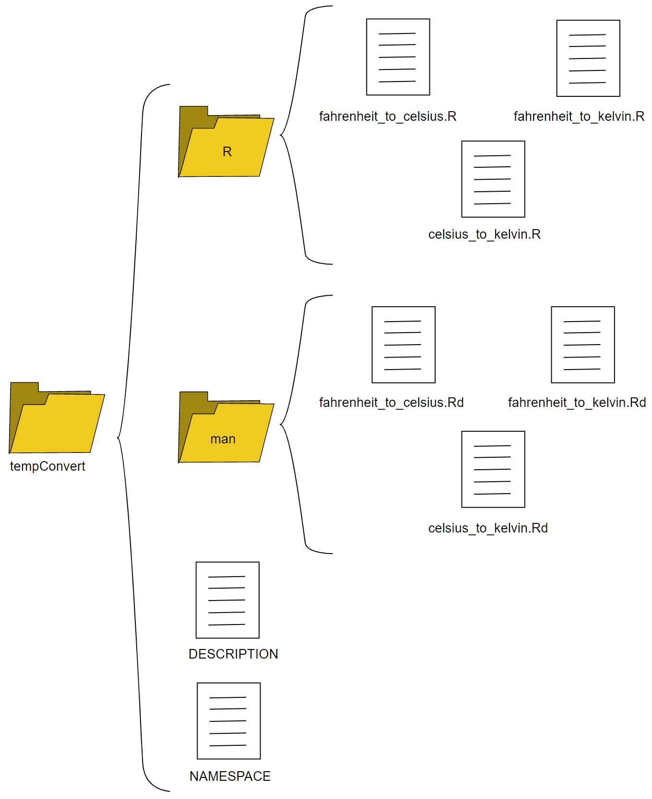
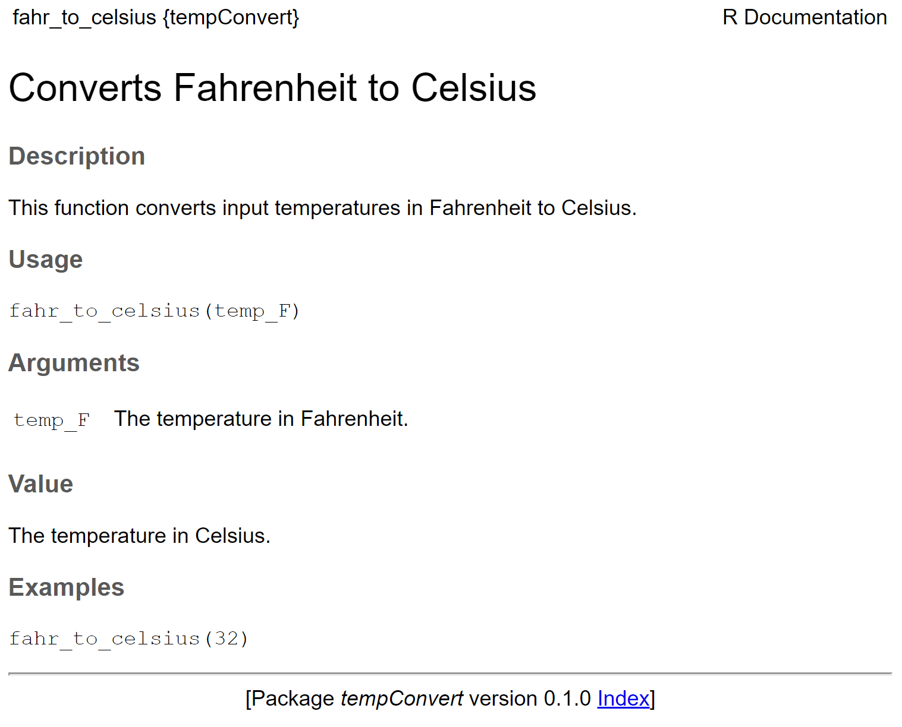
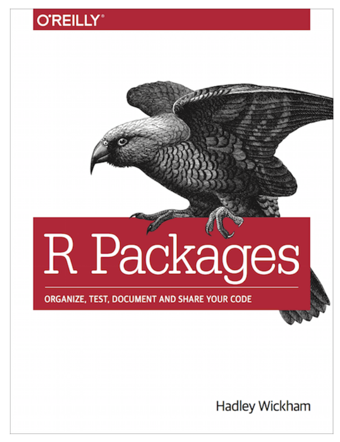

```{r setup, include=FALSE}
knitr::opts_chunk$set(echo = FALSE)
```

## Why should you make your own R packages?

-   Keep track of the miscellaneous R functions that you write and reuse.
-   Easiest way to distribute R code and associated data.
-   Assembling a few R functions within a package will make it way easier for you to use them regularly.

------------------------------------------------------------------------

As Hillary Parker says in [Writing an R package from scratch](https://hilaryparker.com/2014/04/29/writing-an-r-package-from-scratch/):

"Seriously, it doesn't have to be about sharing your code (although that is an added benefit!). It is about saving yourself time."

## Anatomy of an R package

-   **Metadata** via the [ `DESCRIPTION`]{style="color:blue"} file, including the name of the package, description of the package, the version of the package, and any package dependencies.

-   **Source code** via [ `.R`]{style="color:blue"} files, that live in the [ `R/`]{style="color:blue"} directory.

-   Special [ `roxygen`]{style="color:blue"} comments inside the [ `.R`]{style="color:blue"} files that describe how the function operates and its arguments, dependencies, and other metadata.

-   The [ `NAMESPACE`]{style="color:blue"} for the *exported functions* you have written, and the *imported functions* you bring in.

-   Tests that confirm your function "works as intended".

-   Other things (installed files, compiled codem data, tutorials, vignettes).

From Building R packages with devtools and usethis by Tom Mock.

<!-- ## An R package requires four components: -->

<!-- - <span style="color:blue"> DESCRIPTION file </span> with metadata about the package (name, description, version, any package dependencies). -->

<!-- - <span style="color:blue"> R directory </span> with the source code via .R files. -->

<!-- - <span style="color:blue"> man directory </span> with documentation (how the functions operate, and its arguments, dependencies, and other metadata). We will create this automatically, once we populate our package with functions. -->

<!-- - <span style="color:blue"> a NAMESPACE file </span> listing user-level functions in the package. This file will not be modified by hand but we will show you how to do it automatically. Will later contain information on exported and imported functions. -->

<!-- <br /> -->

<!-- <br />  -->

<!-- The package name can only contain letters and numbers and has to start with a letter! -->

## Making your first R package {.smaller}

Let's turn these temperature conversion functions into an R package.

```{r, echo = TRUE}
fahr_to_celsius <- function(temp_F) {
  # Converts Fahrenheit to Celsius
  temp_C <- (temp_F - 32) * 5 / 9
  return(temp_C)
}
```

</font>

```{r, echo = TRUE}
celsius_to_kelvin <- function(temp_C) {
  # Converts Celsius to Kelvin
  temp_K <- temp_C + 273.15
  return(temp_K)
}
```

```{r, echo = TRUE}
fahr_to_kelvin <- function(temp_F) {
  # Converts Fahrenheit to Kelvin using fahr_to_celsius() and celsius_to_kelvin()
  temp_C <- fahr_to_celsius(temp_F)
  temp_K <- celsius_to_kelvin(temp_C)
  return(temp_K)
}
```

## Step 0: Packages you will need

We will use the `devtools`, `usethis` and `roxygen2` packages, which make creating packages in R relatively simple.

```{r, echo = TRUE, message=TRUE}
library("usethis")
library("devtools")
library("roxygen2")
```

These can be installed from CRAN like this:

```{r, echo = TRUE, eval=FALSE}
# installation can be combined
install.packages(c("usethis","devtools","roxygen2"))  
```

## Step 1: Create your package directory

Set your working directory, and then use the `create_package()` to make a framework for your package.

```{r, echo = TRUE, message=FALSE, eval=FALSE}
# Keep the name simple and unique: 
usethis::create_package("tempConvert")
```

Alternatively,

{width="40%"}

## Step 2: Add functions

Add your functions to the R directory. Place each function into a separate R script:

```{r, echo = TRUE, message = FALSE, eval=FALSE}
fahr_to_celsius <- function(temp_F) {
  temp_C <- (temp_F - 32) * 5 / 9
  return(temp_C)
}
```

Alternatively `usethis::use_r("fahr_to_celsius.R")`. This will create a minimal function .R file and open it for interactive editing. We can copy our `fahr_to celsius` function over and add it to this file.

{width="20%"}

## Step 3: Add documentation

The way it works is that you add special comments to the beginning of each function, that will later be compiled into the correct format for package documentation. For example:

```{r, echo = TRUE, message=FALSE, eval=FALSE}
#' Converts Fahrenheit to Celsius
#'
#' This function converts input temperatures in Fahrenheit to Celsius.
#' @param temp_F The temperature in Fahrenheit.
#' @return The temperature in Celsius.
#' @export
#' @examples
#' fahr_to_celsius(32)

fahr_to_celsius <- function(temp_F) {
  temp_C <- (temp_F - 32) * 5 / 9
  return(temp_C)
}
```

## Step 4: Process your documentation

Now you need to create the documentation from your annotations earlier.

The `roxygen2` package reads lines that begin with `#'` as comments to create the documentation for your package. Descriptive tags are preceded with the `@` symbol. For example, `@param` has information about the input parameters for the function. Now, we will use `roxygen2` to convert our documentation to the standard R format.

```{r, echo = TRUE, message=FALSE, eval=FALSE}
devtools::document()
```

This automatically adds in the .Rd files to the `man` directory, and adds a `NAMESPACE` file to the main directory.

## Package directory {.columns-2}

Take a look at the package directory now. The /man directory has a .Rd file for each .R file with properly formatted documentation.

Overall, your package directory should look something like this:

<p class="forceBreak">

</p>

{width="90%"}

## Step 5: Install package

Run this from the parent working directory that contains the tempConvert folder.

```{r, echo = TRUE, message=FALSE, error=FALSE, eval=FALSE}
devtools::install("tempConvert")
```

## Load package

Let's load the package and take a look at the documentation.

```{r, echo = TRUE, eval=FALSE}
library(tempConvert)
```

*Notice there is now a tempConvert environment that is the parent environment to the global environment.*

Now that our package is loaded, let's try out some of the functions.

```{r, echo = TRUE}
fahr_to_celsius(32)
```

Try typing *?fahr_to_celsius*

------------------------------------------------------------------------

{width="70%"}


# Exercises


## Why a package instead of source()?

source()-ing:

-   can be tied to a specific package version
-   testing not included
-   documentation not included
-   requires .R file to be copied in every project that can be modified or deleted (accidentally) by the end-user.

## Further reading

[Creating an R Package](https://sahirbhatnagar.com/rpkg/) by Sahir Rai Bhatnagar

[Building R packages with devtools and usethis](https://www.youtube.com/watch?app=desktop&v=EpTkT6Rkgbs) by Tom Mock

[R packages](https://r-pkgs.org/) by Hadley Wickham

{width="25%"}
