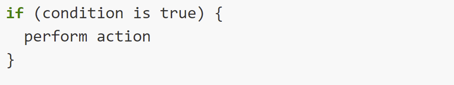
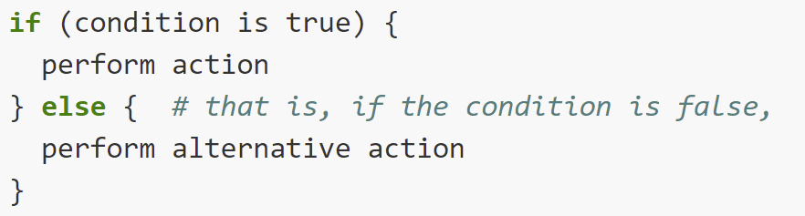

```{r setup, include=FALSE}
knitr::opts_chunk$set(echo = FALSE)
```

------------------------------------------------------------------------

Often when we're coding we want to control the flow of our actions.

This can be done by setting actions to occur only if a condition or a set of conditions are met.

We can write **conditional statements** to return `TRUE`/`FALSE` based on a condition we set, and that outcome will dictate what happens next in our code.

------------------------------------------------------------------------

Conditional statements are made with a range of operators:

-   Does this match? [==]{style="color:blue"}
-   Greater than? [\>]{style="color:blue"}
-   Greater than or equal? [\>=]{style="color:blue"}
-   Less than? [\<]{style="color:blue"}
-   Less than or equal? [\<=]{style="color:blue"}
-   Not equal? [!=]{style="color:blue"}

There are others, including [%in%]{style="color:blue"}, which checks to see if a value is present in a vector of possible values.

For example:

```{r, echo=TRUE}
"zuko" %in% c("aang", "toph", "katara")
```

------------------------------------------------------------------------

We can combine conditions using:

-   The ampersand, [&]{style="color:blue"}, symbolize "and"

```{r, echo=TRUE}
5 > 2 & 6 >=10
```

-   The vertical bar, [\|]{style="color:blue"}, symbolize "or"

```{r, echo=TRUE}
5 > 2 | 6 >=10
```

------------------------------------------------------------------------

Vectors of values compared to a single value return one logical per value:

```{r, echo=TRUE}
state = c('FL', 'FL', 'GA', 'AL')

state == 'FL'
```

We can filter site vector to only return values where the state is equal to 'FL'

```{r, echo=TRUE}
site = c('a', 'b', 'c', 'd')
site[state == 'FL'] 
```

## Conditional statements in R:

-   **if:** if a condition is met, do this. Otherwise, do nothing.

-   **if-else:** if a condition is met, do this. Otherwise, do this other thing.

-   **switch:** "allows a variable to be tested for equality against a list of values. Each value is called a case, and the variable being switched on is checked for each case" (from [tutorialspoint](https://www.tutorialspoint.com/r/r_switch_statement.htm)).

## An if statement

We want R to compute mass according to vegetation type:

```{r, echo=TRUE}
veg_type <- "tree"
volume <- 16.08

# short if statement
if (veg_type == "tree") {
  mass <- 2.65 * volume^0.9
  }
```

General structure:

{width="50%"}

## An if-else statement

We can add more conditions and associated actions with else if

```{r, echo=TRUE}
veg_type <- "grass"
volume <- 16.08

if (veg_type == "tree") {
  mass <- 2.65 * volume^0.9
} else if (veg_type == "grass") {
  mass <- 0.65 * volume^1.2
}
```

General structure:

{width="50%"}

## Built-in function ifelse()

This function accepts both singular and vector inputs and is structured as follows:

`ifelse(condition is true, perform action, perform alternative action)`

For example:

```{r, echo=TRUE}
y <- -3
ifelse(y < 0, "y is a negative number", "y is either positive or zero")
```

## An if-else if-else statement

We can specify what to do if none of the conditions is `TRUE` using else on its own

```{r, echo=TRUE}
veg_type <- "shrub"
volume <- 16.08

if (veg_type == "tree") {
  mass <- 2.65 * volume^0.9
} else if (veg_type == "grass") {
  mass <- 0.65 * volume^1.2
} else {
  mass <- NA
}
```

## Example of nested conditionals and functions {.smaller}

We could have different equations for some vegetation types based on the age of the plant.

```{r, echo=TRUE}
est_mass <- function(volume, veg_type, age){
  if (veg_type == "tree") {
    if (age < 5) {
      mass <- 1.6 * volume^0.8
    } else {
      mass <- 2.65 * volume^0.9
  }
  } else if (veg_type == "grass" | veg_type == "shrub") {
    mass <- 0.65 * volume^1.2
  } else {
    mass <- NA
  }
  return(mass)
}
```

```{r, echo=TRUE}
est_mass(1.6, "tree", age = 2)
```

```{r, echo=TRUE}
est_mass(1.6, "shrub", age = 5)
```

## switch statements

More efficient that a bunch of else-if statements, based on a selection or condition

```{r, echo=TRUE}
veg_type <- "grass"
volume <- 16.08

switch(veg_type,
       "tree" = mass <- 2.65 * volume^0.9,
       "grass" = mass <- 0.65 * volume^1.2,
       mass <- NA)
```

# Exercises

## Further reading

[Making Choices](http://swcarpentry.github.io/r-novice-inflammation/04-cond/index.html) Data Carpentry
