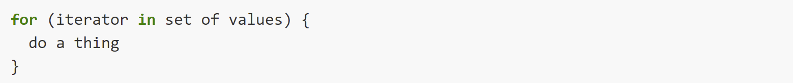
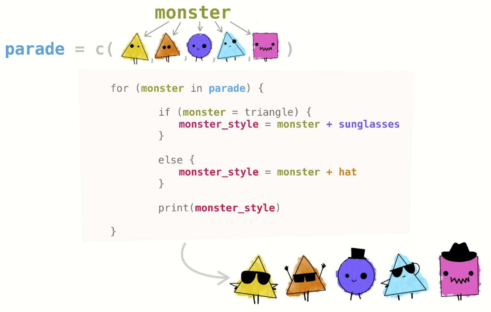

```{r setup, include=FALSE}
knitr::opts_chunk$set(echo = FALSE)
```

------------------------------------------------------------------------

*From Allison Horst's Intro to for loops in R and Python (EDS 221)*

"For loops are common in environmental data science. Like...

-   For each country in a dataset, find the median income by county and create a chloropleth map for the country

-   For each CSV file in my directory, read in the data and append its contents to the end of the existing data frame

-   For each species in the data, access the correct parameters from the data frame and model fish stocks"

## Repeating operations

If you want to iterate over a set of values, when the order of iteration is important, and perform the same operation on each, a for() loop will do the job.

-   Loops are the fundamental structure for repetition in programming

-   for loops perform the same action for each item in a list of things

The basic structure of a for() loop is:

{width="100%"}

## A numeric example {.columns-2}

```{r, echo=TRUE, eval=FALSE}
mass <- seq(from = 0, to = 12, by = 0.5)

for (i in mass){
  new_val = i + 2
  print(new_val)
}
```

-   What does the mass vector contain?
-   What is the output for this loop?

<p class="forceBreak">

</p>

```{r, echo=TRUE, eval=FALSE}
mass <- seq(from = 0, to = 12, by = 0.5)

for (i in seq_along(mass)){
  new_val = mass[i] + 2
  print(new_val)
}
```

Another way to write it...

<!-- seq_along() creates a vector from 1:length(vec) containing integers, and can make it easier to index from the vector your are looping through. -->

<!-- This gives us the same result, but it’s more complicated to understand. So why would we loop by index? -->

<!-- The advantage to looping by index is that it lets us do more complicated things. One of the most common things we use this for are storing the results we calculated in the loop. To do this we start by creating an empty object the same length as the results will be. -->

## Storing outputs from loops

We first create an empty placeholder where the output of the loop will be added.

A general way of creating an empty vector of given length is through the vector() function:

```{r, echo=TRUE, error=FALSE, eval=FALSE}
my_output <- vector(mode = "numeric", length = length(my_vector))
```

------------------------------------------------------------------------

**Example**

```{r, echo=TRUE}
b0 <- c(2.65, 1.28, 3.29)
b1 <- c(0.9, 1.1, 1.2)
volumes = c(1.6, 3, 8)
masses <- vector(mode="numeric", length=length(volumes))

# Note: Looping with an index also allows us to access values from multiple vectors
for (i in seq_along(volumes)){
   mass <- b0[i] * volumes[i] ^ b1[i]
   masses[i] <- mass
}
```

```{r, echo=TRUE}
# Let's have a look at the result
masses
```

## For loops with conditionals

{width="75%"}


