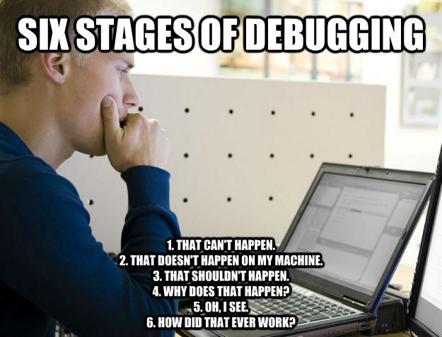
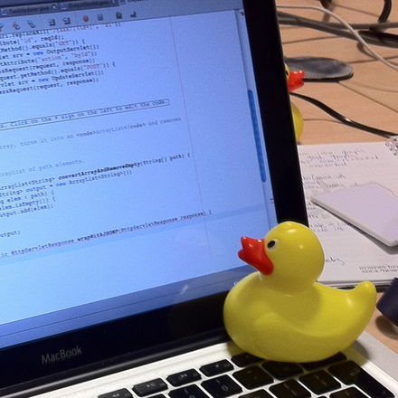

```{r setup, include=FALSE}
knitr::opts_chunk$set(echo = FALSE)
```

## What is debugging? {.columns-2}

The process of stepping through your code to find the source of an unexpected problem. This typically involves:

1.  Running the code.
2.  Stopping the code where something suspicious is taking place.
3.  Looking at the code step-by-step from this point on to either change the values of some variables, or modify the code itself.

<p class="forceBreak">

</p>

{width="100%"}

## How do we figure out what's wrong with a program? {.smaller .columns-2}

-   Read the error message.

    -   Hypothesize about what is wrong.
    -   Make one change that is expected to fix error.
    -   Check if change worked/fixed error.

-   Talk through the code.

    -   Observe what the code is doing.
    -   Rubber duck programming

[**Do not change something without a reason.**]{style="color:black"}

<p class="forceBreak">

{width="50%"}

## Example: Debugging a for loop {.smaller}

Estimating the probability distribution of the numbers of suits in a random draw of five poker cards.

```{r, echo=TRUE, eval=FALSE, error=TRUE}
cards <- rep(c("diamonds","clubs","spades","hearts"), 13)

for(i in 1:10000){

  # random draw of 5 cards
  s <- sample(cards, 5)
  
  # number of suits in this draw
  n <- length(s)
  
  # increment observation of n
  obs[n] <- obs[n] + 1
}

barplot(obs/sum(obs),
        main = "Number of suits in a random draw of 5 poker cards",
        xlab = "Number of suits",
        ylab = "Estimated probability",
        names.arg = 1:4)
```

What happen if we source this code?

## Example: Debugging a for loop {.smaller}

Estimating the probability distribution of the numbers of suits in a random draw of five poker cards.

```{r, echo=TRUE, eval=TRUE, error=TRUE}
cards <- rep(c("diamonds","clubs","spades","hearts"), 13)

for(i in 1:10000){

  # random draw of 5 cards
  s <- sample(cards, 5)
  
  # number of suits in this draw
  n <- length(s)
  
  # increment observation of n
  obs[n] <- obs[n] + 1
}

barplot(obs/sum(obs),
        main = "Number of suits in a random draw of 5 poker cards",
        xlab = "Number of suits",
        ylab = "Estimated probability",
        names.arg = 1:4)
```

# Example: Debugging a for loop \| Manually

## How can we trace mistakes...?

Here three basic debugging techniques:

1)  Reduce number of iterations

2)  Inspect variables during the loop with print().

3)  If the for-loop makes calls to R's random generator, set seed. (e.g., `sample()` or `rnorm()`. So fix a seed before the loop so that results are reproducible).

<!-- Variables not initialized properly before entering a loop. -->

# Example: Debugging a for loop \| With R built-in functions

## Debugging a for loop with debugonce() {.smaller}

```{r, echo=TRUE, eval=FALSE}
function.for <- function(nsim=10000) {

  # This function estimates the probability distribution of the numbers of suits
  # in a random draw of five poker cards.
  cards <- rep(c("diamonds","clubs","spades","hearts"), 13)

  for(i in 1:nsim){

    # random draw of 5 cards
    s <- sample(cards, 5)

    # number of suits in this draw
    n <- length(s)

    # increment observation of n
    obs[n] <- obs[n] + 1
  }

  barplot(obs/sum(obs),
        main = "Number of suits in a random draw of 5 poker cards",
        xlab = "Number of suits",
        ylab = "Estimated probability",
        names.arg = 1:4)

  return(obs)
}
```

## Base R debug functions

`debugonce()`

`debug(), undebug()`

`browser()`

`traceback()`

`options(error = browser), options(error = NULL)`

## RStudio IDE debugging tools

-   Editor breakpoint

-   Browser breakpoint

-   Debug mode

    -   source pane highlighting
    -   context-specific Environment pane, including a Traceback panel
    -   browser prompt into Console pane

-   "Show traceback" shortcut

-   "Rerun with debug" shortcut

-   Debug menu

## Further reading

[Debugging, condition handling, and defensive programming](http://adv-r.had.co.nz/Exceptions-Debugging.html) by Hadley Wickham

[How to become a better R code detective?](https://masalmon.eu/2021/07/13/code-detective/) by Maëlle Salmon

[Debugging techniques in RStudio](https://www.rstudio.com/resources/rstudioconf-2018/debugging-techniques-in-rstudio/) by Amanda Gadrow's talk at rstudio::conf 2018
